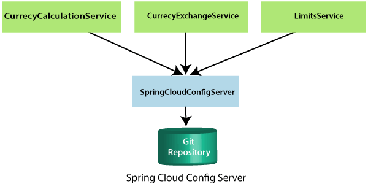

# ONLINE STORE

Proyecto para aplicar lecciones aprendidas sobre microservicios

## Tecnologias

- Spring 2.2.5.RELEASE
- Java 11
- JSON
- Microservices
- Eureka
- JPA
- Config server
- Sleuth
- Config Cloud
- Hystrix

## Config Cloud



## Actualizaciones

- Queda pendiente revisar la actualización de la versión de spring (2.7). En estas versiones hay cambios importantes en
  `H2`, las validaciones ya no forman parte de la depencia web ahora se encuentra separado
  en `spring-boot-starter-validation`.

````yaml
# Adicionalmente en el bootstrap.yml agregar lo siguiente
server:
  error:
    include-message: always
    include-binding-errors: always
````

- Evolucionar hacia una administración con docker y kubernetes

## Enlaces de interés

- https://www.javatpoint.com/connect-spring-cloud-config-server-to-local-git-repository